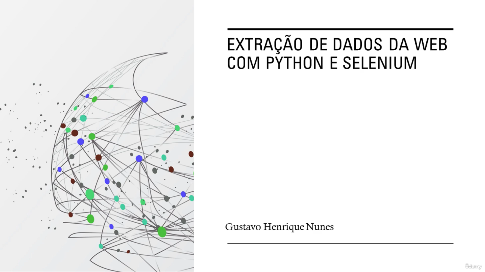

 

<h1 align="center"> Udemy - Extração de Dados da Web com Python e Selenium </h1>

O curso de Extração de dados da WEB com Python e Selenium, ministrado pelo professor Gustavo Henrique Nunes, apresenta conceitos teóricos e práticos para permitir que façamos a extração de textos e imagens de páginas da WEB. 

 

  

 

  <a href="#-tecnologias">🚀 Tecnologias</a>&nbsp;&nbsp;&nbsp;|&nbsp;&nbsp;&nbsp;
  <a href="#-certificado">📜 Certificado</a>&nbsp;&nbsp;&nbsp;|&nbsp;&nbsp;&nbsp;
  <a href="#memo-licença">:memo: Licença</a>

 

## 🚀 Tecnologias

Neste curso foi utilizada a seguinte tecnologia:

 

## 📜 Certificado

Conclusão do Curso: 25/07/2023

  

 

## :memo: Licença

Esse projeto está sob a licença MIT.

---

Desenvolvido por [Thiago Honorato](https://www.linkedin.com/in/honoratothiago/)
